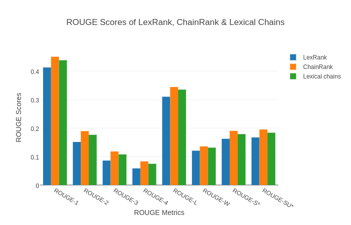

# TheChainRanker
Automated text summarization system using Lexical chains and Lex Rank.

**ChainRank** is a semantically aware LexRank algorithm for automatic text summarization. ChainRank provides huge improvements on LexRank by using Lexical Chains to extract meaningful sentences, and then using these to provide bias to the sentence connectivity relations determined by LexRank.

Here is a comparison,

